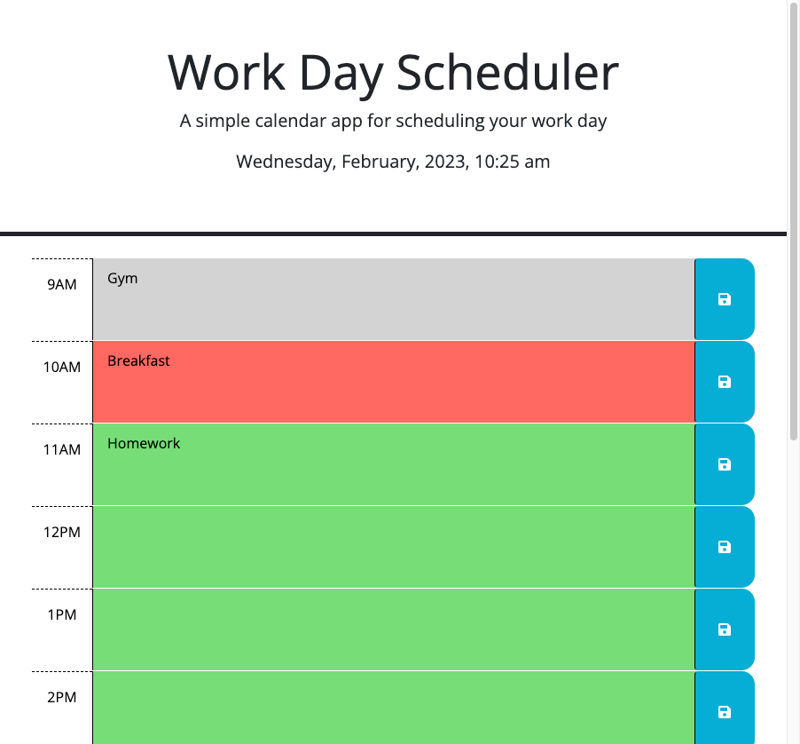

# Description

This daily planner is designed to help busy employees manage their time effectively by allowing them to easily add important events to their schedule.

## Features
The current day is displayed at the top of the calendar when the planner is opened.
The planner displays timeblocks for standard business hours, which are color coded to indicate whether they are in the past, present, or future.
Users can click into a timeblock to enter an event, and click the save button to store the event in local storage.
Saved events persist even when the page is refreshed.

## Mock-up

## Build with
> - HTML
> - CSS
> - JavaScript
> - JQuery

## Usage
Open the Daily Planner in your browser.
The current day will be displayed at the top of the calendar.
Scroll down to view the timeblocks for standard business hours.
Click into a timeblock to enter an event.
Click the save button to store the event in local storage.
Refresh the page to see that the saved events persist.
Note
This is just a sample readme file for the given User Story, actual implementation and details might vary.

## Testing
You can also refer to source code to test it [Source code](https://github.com/IaroslavLasiichuk/password-generator/work-day-scheduler).